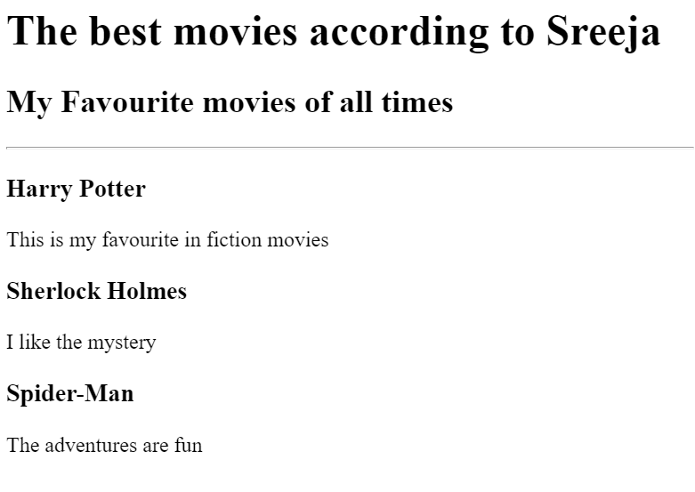

# Sreeja's Portfolio

This is a simple HTML portfolio created by Sreeja, showcasing her web development and machine learning projects. The portfolio includes links to different projects, an "About Me" section, and a "Contact Me" section.

## Table of Contents
- [Introduction](#introduction)
- [Projects](#projects)
  - [Movie Ranking Project](#movie-ranking-project)
  - [Birthday Invite Project](#birthday-invite-project)
- [About Me](#about-me)
- [Contact Me](#contact-me)

## Introduction

The HTML file provided represents Sreeja's portfolio website. It contains a simple layout with a header, project sections, and links to the "About Me" and "Contact Me" pages. The portfolio showcases Sreeja's skills as a web developer and her enthusiasm for machine learning.

## Projects

### Movie Ranking Project
The [Movie Ranking Project](public/movie-ranking.html) is one of the projects featured in Sreeja's portfolio. This project focuses on movie rankings. To get a glimpse of the project, you can check the screenshot below:

### Birthday Invite Project
The [Birthday Invite Project](public/birthday-invite.html) is another project included in Sreeja's portfolio. This project involves creating birthday invitations. Here's a preview of the project:

## About Me
To learn more about Sreeja and her background, you can visit the [About Me](public/about.html) page.

## Contact Me
If you would like to get in touch with Sreeja regarding her portfolio or any other inquiries, please visit the [Contact Me](public/contact.html) page.

Feel free to explore the portfolio and learn more about Sreeja's web development and machine learning projects!
